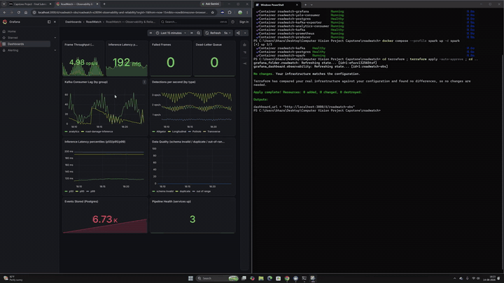
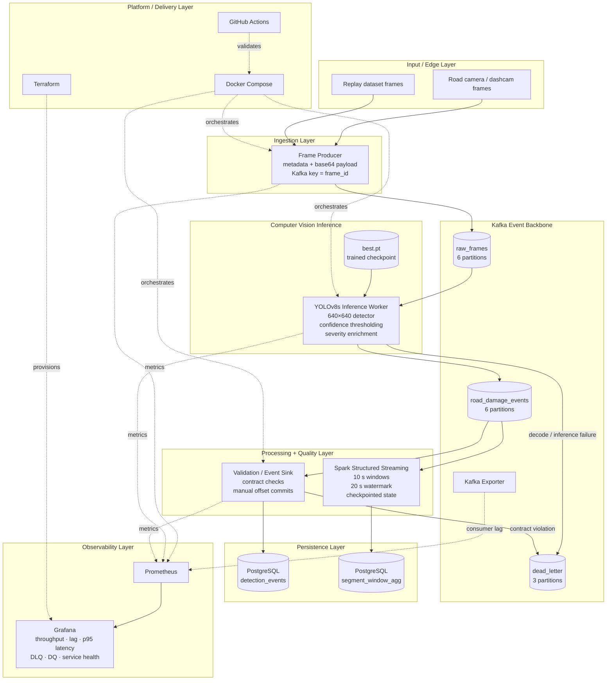
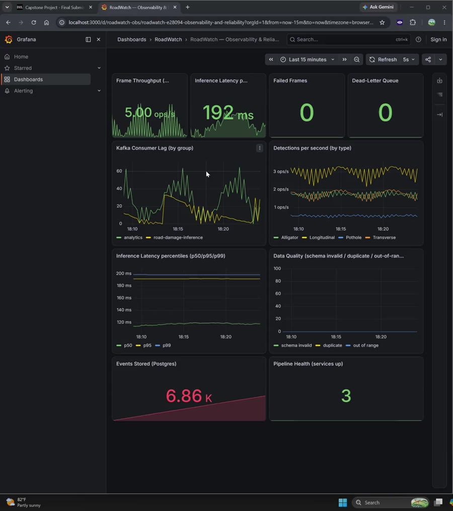
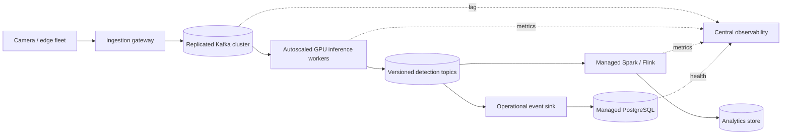
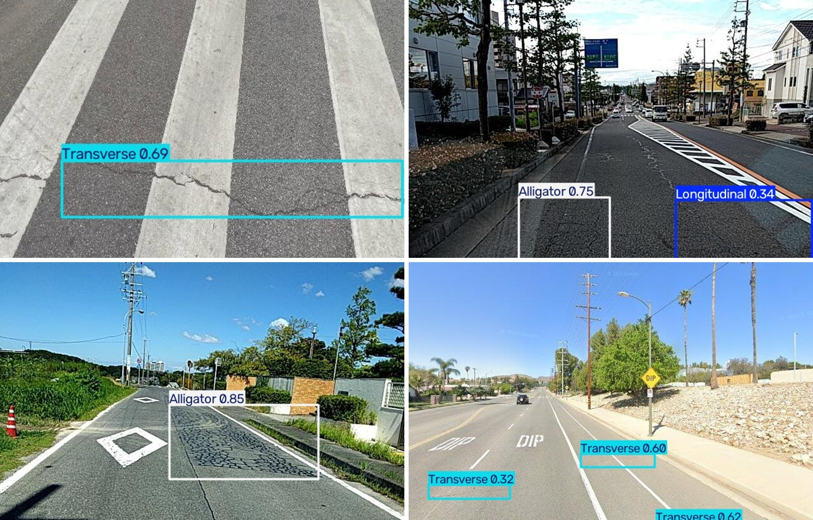

# RoadWatch — Streaming Reliability & Observability Platform

**RoadWatch** is an end-to-end **streaming reliability and observability platform** for real-time road-infrastructure analytics. It continuously ingests image frames, runs YOLOv8s inference, moves versioned events through Kafka, validates and persists them, and processes live aggregates with Spark Structured Streaming — while **Prometheus and Grafana expose pipeline health, throughput, consumer lag, p95 latency, failures, data-quality rejects, and service liveness from end to end**.

The primary engineering focus is making the streaming system **observable, replayable, and recoverable**, so engineers can quickly understand what is happening across the pipeline as continuous frames move from ingestion through inference, event processing, persistence, and analytics.

**Portfolio repository maintained by Aarjav Jain**

<p align="center">
  
</p>

<p align="center">
  <a href="demo/RoadWatch_Demo.mp4"><strong>▶ Watch the full end-to-end demo</strong></a>
  &nbsp;·&nbsp;
  <a href="docs/ARCHITECTURE.md">Architecture</a>
  &nbsp;·&nbsp;
  <a href="docs/RELIABILITY.md">Reliability</a>
  &nbsp;·&nbsp;
  <a href="docs/EVENT_CONTRACT.md">Event contracts</a>
  &nbsp;·&nbsp;
  <a href="docs/OPERATIONS.md">Operations</a>
  &nbsp;·&nbsp;
  <a href="docs/MODEL.md">CV model</a>
</p>

---

## What RoadWatch demonstrates

RoadWatch is designed first as an **observable and reliable streaming data platform**, with a real computer-vision inference stage integrated into the event pipeline. The core engineering story is the system around the model: durable event boundaries, replay-safe processing, stream aggregation, data-quality controls, operational visibility, infrastructure-as-code, and failure recovery.

| Capability | Implementation |
|---|---|
| **Event backbone** | Apache Kafka 3.8 in KRaft mode with explicit topics, partitions, consumer groups, acknowledgements and replay |
| **Inference** | YOLOv8s worker consumes frames from Kafka and emits structured road-damage events |
| **Stream processing** | Spark Structured Streaming with event-time windows, watermarking and persistent checkpoints |
| **Durable persistence** | PostgreSQL event store + window aggregate table with deterministic IDs and idempotent inserts |
| **Data contracts** | Versioned event schema, trace IDs, required-field checks, enum/range validation and DLQ quarantine |
| **Recovery semantics** | Manual offset commits, Kafka retention/replay, deterministic detection IDs and duplicate absorption |
| **Observability** | Prometheus metrics + Kafka Exporter + Grafana dashboard for throughput, p95 latency, lag, failures, DQ and liveness |
| **Infrastructure** | Docker Compose for the complete local platform; Terraform for Grafana resources |
| **Delivery quality** | GitHub Actions tests, Python compile checks, Compose validation and JSON/YAML validation |
| **Model reproducibility** | Training notebook, training/evaluation scripts, deployed `best.pt`, metrics and evaluation plots included |

---

# Platform architecture



The architecture intentionally separates **data plane**, **processing plane**, and **operational plane** so failures remain observable and replayable instead of being hidden inside one monolithic pipeline.

See **[Architecture](docs/ARCHITECTURE.md)** for service boundaries, Kafka topology, sequence diagrams, persistence design, failure domains and scale-out mapping.

---

## End-to-end event flow

```text
road image
   │
   ▼
Frame Producer
   │  versioned frame event + trace_id
   ▼
raw_frames  ──────────────────────────────┐
   │                                      │
   ▼                                      │ Kafka retains backlog
YOLOv8s inference worker                  │ during consumer outage
   │                                      │
   ├── failure ───────────────► dead_letter
   │
   ▼
road_damage_events
   │
   ├────────► Validation + PostgreSQL event sink
   │             │
   │             └── malformed event ───► dead_letter
   │
   └────────► Spark Structured Streaming
                    │
                    ▼
              10-second segment / damage aggregates
```

Three Kafka topics form explicit boundaries:

| Topic | Partitions | Producer | Consumers | Purpose |
|---|---:|---|---|---|
| `raw_frames` | 6 | Frame producer | YOLO inference group | Decouples image ingestion from inference |
| `road_damage_events` | 6 | YOLO worker | Persistence consumer + Spark | Durable structured detection stream |
| `dead_letter` | 3 | YOLO + validator | Operations / replay tooling | Preserves failed or invalid records for diagnosis |

---

# Reliability and replay design

RoadWatch uses **at-least-once delivery with idempotent downstream effects**.

1. Kafka producers use `acks=all`, retries, and producer idempotence.
2. Consumers disable automatic offset commits.
3. A frame offset is committed only after all derived detection events are acknowledged by Kafka.
4. Failed frames are committed only after a DLQ event is acknowledged.
5. Detection IDs are deterministic: `evt_<frame_id>_<detection_index>`.
6. PostgreSQL uses `event_id` as the primary key and `ON CONFLICT DO NOTHING` to absorb replayed duplicates.
7. Spark uses a persistent checkpoint volume and event-time watermarking.
8. Kafka Exporter exposes consumer lag so backlog is visible during service degradation.
9. Prometheus/Grafana surface throughput, latency, failures, DLQ growth, DQ rejects, persistence counts and liveness.

This avoids the misleading claim that Kafka, Spark and PostgreSQL participate in one distributed exactly-once transaction while still providing strong replay/recovery behavior at each boundary.

More detail: **[Reliability & Recovery](docs/RELIABILITY.md)**.

---

# Observability

<p align="center">
  
</p>

The dashboard is built around operational questions:

- Is the producer still publishing frames?
- Is inference keeping up with ingress?
- Is Kafka consumer lag increasing?
- What are p50 / p95 / p99 inference latencies?
- Are frames failing decode or inference?
- Are schema-invalid events reaching the DLQ?
- Are duplicate/replayed events being absorbed?
- Are validated events reaching PostgreSQL?
- Are producer, YOLO worker and persistence consumer alive?

### Recovery drill

```bash
docker compose stop yolo-consumer
# producer keeps writing; roadwatch-inference lag grows

docker compose start yolo-consumer
# retained frames replay from the last committed offset and lag drains
```

The recorded demo includes this backlog/recovery behavior.

**[▶ Watch RoadWatch_Demo.mp4](demo/RoadWatch_Demo.mp4)**

---

# Quick start

### Prerequisites

- Docker Desktop / Docker Engine with Compose v2
- ~6 GB free memory recommended for the complete local stack
- Terraform CLI only if you want to reprovision the Grafana dashboard as code

The repository already includes:

- trained checkpoint: `model/weights/best.pt`
- replay frames: `data/frames/`
- Grafana dashboard + Prometheus configuration
- PostgreSQL schema
- model training/evaluation code and notebook

### 1. Start the core platform

```bash
cp .env.example .env
docker compose build
docker compose up -d
docker compose ps
```

The `kafka-init` service explicitly creates the Kafka topics before the application services start.

### 2. Start Spark analytics

```bash
docker compose --profile spark up -d spark
```

### 3. Open operational views

- **Grafana:** `http://localhost:3000`
- **Prometheus:** `http://localhost:9090`
- **Kafka host listener:** `localhost:29092`
- **PostgreSQL:** `localhost:5432`

### 4. Query durable detection events

```bash
docker exec -it roadwatch-postgres \
  psql -U roadwatch -d roadwatch \
  -c "SELECT damage_type, severity, COUNT(*) FROM detection_events GROUP BY 1,2 ORDER BY 3 DESC;"
```

### 5. Inspect the DLQ

```bash
docker exec roadwatch-kafka /opt/kafka/bin/kafka-console-consumer.sh \
  --bootstrap-server localhost:9092 \
  --topic dead_letter \
  --from-beginning \
  --max-messages 20
```

### 6. Tear down

```bash
docker compose --profile spark down -v
```

Operational commands and failure drills: **[Operations Runbook](docs/OPERATIONS.md)**.

---

# Repository structure

```text
.
├── docker-compose.yml                    # End-to-end service orchestration
├── streaming/
│   ├── producer.py                       # Road-frame Kafka producer
│   ├── yolo_consumer.py                  # Real YOLOv8s inference worker
│   ├── analytics_consumer.py             # Validation + idempotent PostgreSQL sink
│   ├── spark_stream.py                   # Windowed Spark analytics
│   ├── contracts.py                      # Versioned detection contract
│   └── Dockerfile                        # CPU inference / streaming image
├── model/
│   ├── weights/best.pt                   # Deployed YOLOv8s checkpoint
│   ├── train.py                          # Training entry point
│   ├── evaluate.py                       # Validation / metric generation
│   ├── prepare_subset.py                 # RDD2022 data preparation
│   └── export_onnx.py                    # Model export path
├── notebooks/
│   └── RoadWatch_Model_Training.ipynb    # End-to-end model training notebook
├── db/init.sql                           # Event + aggregate tables / indexes
├── observability/
│   ├── prometheus/                       # Metrics scraping
│   └── grafana/                          # Dashboard + provisioning
├── terraform/                            # Grafana infrastructure-as-code
├── data/frames/                          # 54 replay/sample road frames
├── results/                              # Training/evaluation plots + raw eval log
├── demo/RoadWatch_Demo.mp4               # Recorded system demo
├── docs/                                 # Architecture / reliability / operations / model docs
├── tests/                                # Event-contract tests
└── .github/workflows/quality.yml         # Automated repository validation
```

---

# Event contract

A detection event is versioned and traceable across the platform:

```json
{
  "event_version": "1.0",
  "event_id": "evt_frame_000104_000",
  "trace_id": "frame_000104",
  "frame_id": "frame_000104",
  "camera_id": "dashcam_001",
  "timestamp": "2026-09-04T20:15:31.110Z",
  "source_image": "Japan_000474.jpg",
  "road_segment": "segment_09",
  "damage_type": "Pothole",
  "confidence": 0.87,
  "bbox": [210.0, 295.0, 402.0, 465.0],
  "bbox_area_ratio": 0.063,
  "severity": "High",
  "latency_ms": 173.4
}
```

The contract is intentionally stable across model, persistence and streaming-analytics components. See **[Event Contracts](docs/EVENT_CONTRACT.md)**.

---

# Scale-out design

The local implementation preserves boundaries that map cleanly to a larger deployment:



| Local implementation | Scale-out equivalent |
|---|---|
| Single Kafka broker | Replicated managed Kafka cluster |
| `yolo-consumer` container | Partition-scaled GPU inference worker pool |
| Local PostgreSQL | Managed HA PostgreSQL / operational event store |
| Spark container | Managed Spark / Kubernetes stream-processing service |
| Local Prometheus/Grafana | Centralized managed observability |
| `.env` credentials | Secrets manager / workload identity |
| Docker Compose | Kubernetes / ECS / Nomad |

---

# Computer vision layer

The CV component is kept deliberately compact in the main README because RoadWatch is primarily presented as a streaming/data-platform system, but the full model artifacts remain reproducible in the repository.

### Model

- **Architecture:** YOLOv8s
- **Dataset:** RDD2022 road-damage imagery
- **Training subset:** 15,000 images
- **Validation subset:** 3,000 images
- **Input:** 640 × 640
- **Classes:** Longitudinal crack, Transverse crack, Alligator crack, Pothole
- **Deployed checkpoint:** [`model/weights/best.pt`](model/weights/best.pt)
- **Training notebook:** [`notebooks/RoadWatch_Model_Training.ipynb`](notebooks/RoadWatch_Model_Training.ipynb)

### Validation results

| Metric | YOLOv8n baseline | YOLOv8s |
|---|---:|---:|
| Precision | 0.448 | **0.582** |
| Recall | 0.377 | **0.513** |
| mAP@50 | 0.358 | **0.532** |
| mAP@50–95 | 0.150 | **0.259** |

Per-class mAP@50: **Alligator 0.638 · Longitudinal 0.544 · Transverse 0.535 · Pothole 0.411**.

<p align="center">
  
</p>

Detailed training, evaluation and inference notes: **[CV Model](docs/MODEL.md)** and **[Results](docs/RESULTS.md)**.

---

# Training and evaluation

To reproduce model training after downloading RDD2022:

```bash
python model/prepare_subset.py \
  --train_images <RDD>/train/images \
  --val_images <RDD>/val/images \
  --out_dir data/rdd2022_large \
  --max_train 15000 \
  --max_val 3000

python model/train.py \
  --data data/rdd2022_large/data.yaml \
  --model yolov8s.pt \
  --epochs 60 \
  --imgsz 640
```

Evaluation:

```bash
python model/evaluate.py \
  --weights model/weights/best.pt \
  --data data/rdd2022_large/data.yaml
```

The original notebook workflow is preserved at [`notebooks/RoadWatch_Model_Training.ipynb`](notebooks/RoadWatch_Model_Training.ipynb).

---

# Documentation

| Document | Focus |
|---|---|
| [Architecture](docs/ARCHITECTURE.md) | Data plane, service boundaries, event sequence, Kafka topology, persistence, scale-out |
| [Reliability](docs/RELIABILITY.md) | Delivery semantics, replay, offset strategy, idempotency, DLQ, observability |
| [Event Contracts](docs/EVENT_CONTRACT.md) | Versioned Kafka schemas and validation rules |
| [Operations](docs/OPERATIONS.md) | Startup, health checks, queries, recovery drills, DLQ inspection |
| [CV Model](docs/MODEL.md) | Training pipeline, deployment contract, inference path |
| [Results](docs/RESULTS.md) | Model metrics and evaluation plots |
| [Demo](docs/DEMO.md) | What the recorded demo shows |
| [Dataset](docs/DATASET.md) | RDD2022 data notes |

---

## Third-party assets and licensing

RDD2022, Ultralytics YOLO, container images, Python packages, Kafka, Spark, PostgreSQL, Prometheus, Grafana and Terraform retain their respective licenses and terms. The repository includes a trained Ultralytics checkpoint and a small set of RDD2022 sample frames for reproducibility. Review **[THIRD_PARTY_NOTICES.md](THIRD_PARTY_NOTICES.md)** before redistribution or commercial reuse.
