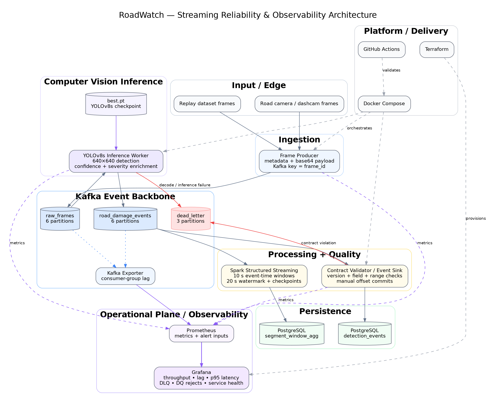
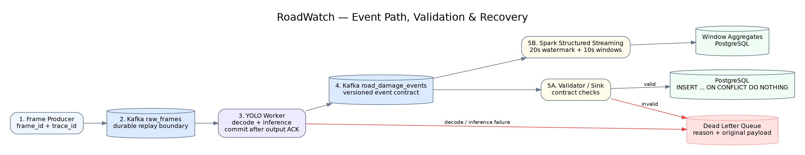
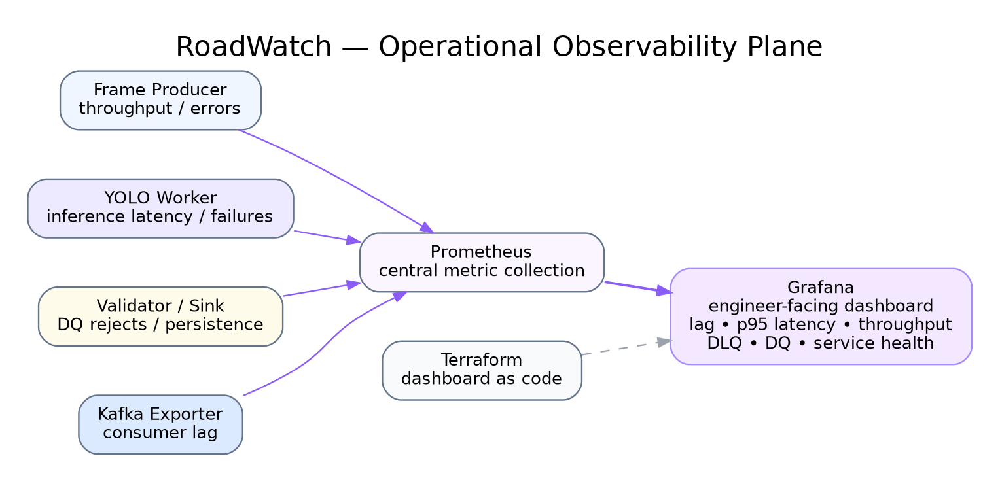

# RoadWatch Architecture

## 1. System objective

RoadWatch converts a continuous road-image stream into two durable outputs:

1. **Validated event-level road-damage telemetry** for operational and downstream use.
2. **Windowed segment-level aggregates** for near-real-time analytics.

A YOLOv8s detector provides the inference stage, while Kafka, Spark, PostgreSQL and the observability stack provide the system boundaries around it.

## 2. Architecture principles

The design follows five principles:

- **Decouple ingestion from inference** so source availability does not depend on model-worker availability.
- **Use explicit event contracts** so independent services evolve around stable schemas.
- **Make replay safe** through manual commits, deterministic IDs and idempotent persistence.
- **Separate raw events from aggregates** so detailed telemetry remains queryable while Spark produces analytical summaries.
- **Treat observability as part of the architecture**, not an afterthought.

## 3. Logical architecture



## 4. Data plane sequence



## 5. Kafka topology

| Topic | Partitions | Key | Producer | Consumer group / processor |
|---|---:|---|---|---|
| `raw_frames` | 6 | `frame_id` | `producer.py` | `roadwatch-inference` |
| `road_damage_events` | 6 | `event_id` | `yolo_consumer.py` | `roadwatch-persistence`, Spark |
| `dead_letter` | 3 | source ID | YOLO / validator | operator tooling |

Explicit topic creation keeps topology intentional and makes partitioning visible in source control.

## 6. Component responsibilities

| Component | Responsibility |
|---|---|
| `streaming/producer.py` | Replays image frames, attaches camera/segment/timestamp metadata, base64-encodes payloads, publishes keyed frame events |
| Kafka | Durable asynchronous boundary between ingestion, inference and downstream processing |
| `streaming/yolo_consumer.py` | Loads `best.pt`, decodes frames, runs YOLOv8s inference, enriches detections with severity, emits deterministic events, routes failures to DLQ |
| `streaming/contracts.py` | Defines event version, allowed classes, required fields and validation helpers |
| `streaming/analytics_consumer.py` | Validates event contract, quarantines invalid records and writes valid events idempotently to PostgreSQL |
| `streaming/spark_stream.py` | Computes 10-second event-time aggregates by segment and damage type with watermarking/checkpointing |
| PostgreSQL | Stores individual validated events and Spark aggregate outputs |
| Kafka Exporter | Exposes topic / partition / consumer-group lag metrics |
| Prometheus | Scrapes producer, inference, persistence and Kafka metrics |
| Grafana | Presents operational health, latency, lag, throughput, DQ and failure signals |
| Terraform | Provisions Grafana resources declaratively |
| Docker Compose | Reproduces the multi-service environment and service dependencies |
| GitHub Actions | Runs contract tests, compile checks and configuration validation |

## 7. Event identity and lineage

Every frame gets a stable `frame_id` and `trace_id`. Derived detections use deterministic IDs:

```text
evt_<frame_id>_<detection_index>
```

This gives a straightforward lineage chain:

```text
source image -> frame_id / trace_id -> YOLO detection -> event_id -> PostgreSQL row / Spark aggregate
```

Deterministic identity is especially important when Kafka replays an input after a restart.

## 8. Persistence model

### `detection_events`

Stores the validated event stream. `event_id` is the primary key. Inserts use `ON CONFLICT (event_id) DO NOTHING`, so replaying the same logical detection does not create another record.

Indexes support common operational queries by segment/time, damage type/time and trace ID.

### `segment_window_agg`

Stores Spark's 10-second event-time windows keyed by window start, road segment and damage type.

### Spark checkpoint

A named Docker volume backs the Structured Streaming checkpoint path so query progress and state survive Spark container restarts.

## 9. Operational plane

The operational plane remains independent from business processing:



This separation means a backlog or failure can still be diagnosed while a processing stage is degraded.

## 10. Failure domains

| Failure | Expected behavior |
|---|---|
| YOLO worker stopped | `raw_frames` continues accumulating; inference-group lag rises; replay resumes from last committed offset |
| Image decode / inference exception | Source frame is written to `dead_letter`, then its offset is acknowledged |
| Malformed detection event | Validator writes event + reason to `dead_letter`; invalid row never reaches operational storage |
| PostgreSQL unavailable | Persistence consumer does not commit the failing event; Kafka retains it for replay |
| Spark restarted | Persistent checkpoint recovers Structured Streaming progress/state |
| Producer retry | Kafka producer idempotence reduces duplicate writes from retry behavior |
| Replayed detection | Deterministic `event_id` + PostgreSQL PK absorbs duplicate persistence side effects |

## 11. Scale-out mapping

| Repository implementation | Larger deployment mapping |
|---|---|
| Kafka KRaft single broker | Replicated multi-broker managed Kafka |
| 6-partition frame/event topics | Partition count sized to camera and inference throughput |
| One CPU YOLO worker | Consumer-group pool of GPU-backed inference workers |
| PostgreSQL container | Managed HA PostgreSQL / operational event store |
| Local Spark | Managed Spark / Kubernetes / Flink |
| Local Grafana/Prometheus | Central observability stack |
| Docker Compose | Kubernetes / ECS / Nomad |
| `.env` secrets | Secrets manager / workload identity |

The important part is that each scale-out change can happen behind the same event contracts rather than forcing a rewrite of the full system.
