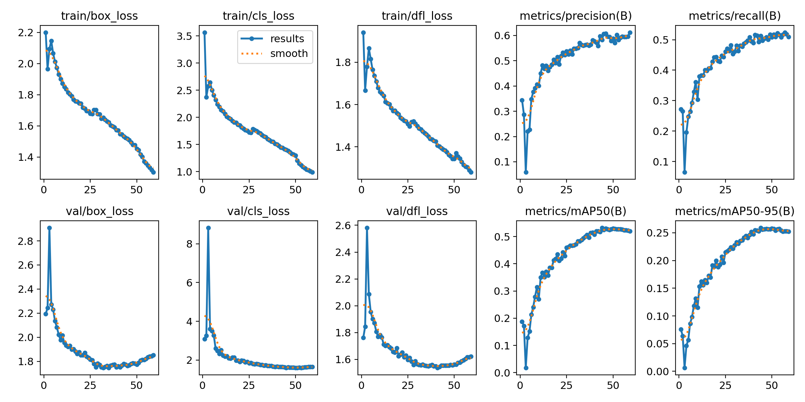
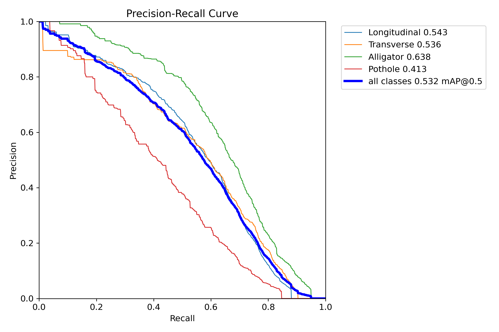
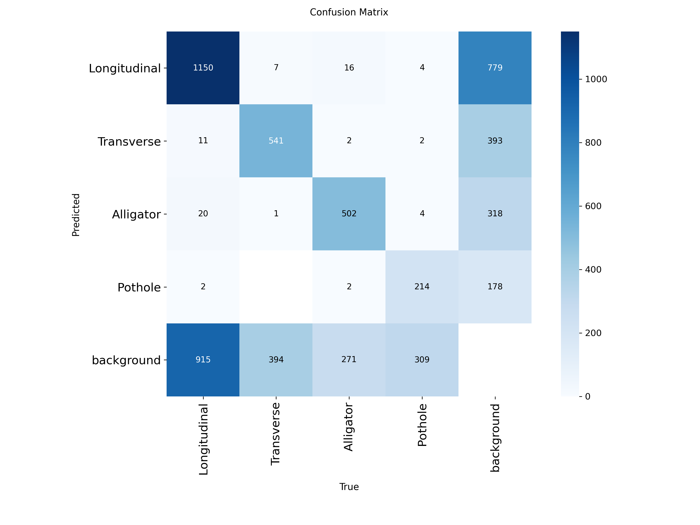

# Model Evaluation Results

## Validation configuration

- Model: YOLOv8s
- Training images: 15,000
- Validation images: 3,000
- Validation damage instances: 4,367
- Input resolution: 640 × 640
- Training: up to 60 epochs with early-stopping patience
- Classes: Longitudinal, Transverse, Alligator, Pothole

## Overall metrics

| Metric | YOLOv8n baseline | YOLOv8s | Change |
|---|---:|---:|---:|
| Precision | 0.448 | **0.582** | +0.134 |
| Recall | 0.377 | **0.513** | +0.136 |
| mAP@50 | 0.358 | **0.532** | +0.174 |
| mAP@50–95 | 0.150 | **0.259** | +0.109 |

These values are held-out validation metrics for the trained detector.

## Per-class mAP@50

| Damage class | mAP@50 | Validation instances |
|---|---:|---:|
| Alligator | **0.638** | 793 |
| Longitudinal | **0.544** | 2,098 |
| Transverse | **0.535** | 943 |
| Pothole | **0.411** | 533 |

## Evaluation plots

### Representative detections

### Training curves

### Precision–recall curves

### Confusion matrix

## Streaming demo measurements

The recorded CPU inference run shows approximately:

- **~5 frames/second** processing rate with one inference worker
- **~119 ms p50** per-frame inference latency
- **~192 ms p95** per-frame inference latency

These measurements describe the recorded environment and are included to connect model latency to the streaming-system behavior.

The raw Ultralytics evaluation output is preserved at [`results/final_evaluation.log`](../results/final_evaluation.log).
